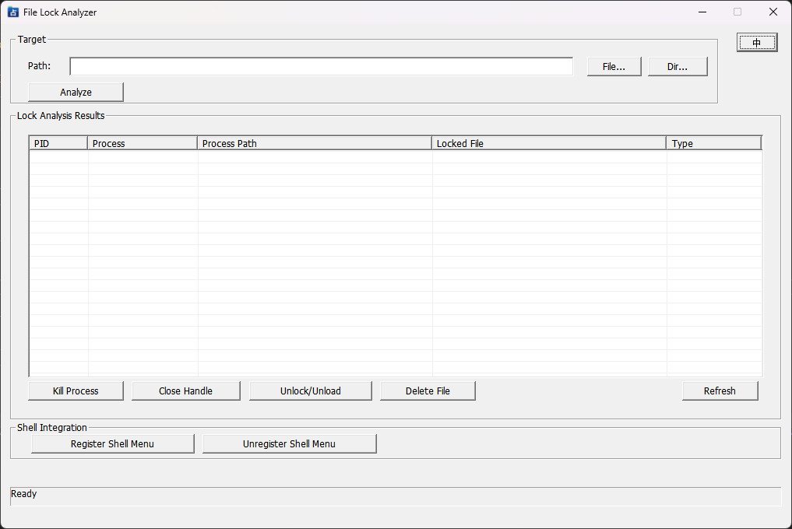

# FileUsageAnalyzer

[](#) [](./README.zh-CN.md)

**File Lock Analyzer** — a native Windows desktop tool (C++17 / MFC) that tells you *"which process is holding this file/folder"*, and provides multiple unlock strategies: kill process, force-close remote handle, unload DLL, etc. It also ships with a Windows Explorer right-click context menu integration.



## Features

| Capability | Details |
|---|---|
| Lock detection (primary) | Windows Restart Manager API (`Rstrtmgr.lib`) — stable, OS-blessed |
| Lock detection (fallback) | `NtQuerySystemInformation` SystemExtendedHandleInformation (Class 64) — cross-process handle-table scan, catches kernel-mode handle types the Restart Manager misses |
| Unlock method 1 | Kill the holding process (`TerminateProcess`) |
| Unlock method 2 | Force-close a file handle inside the target process via `DuplicateHandle(... DUPLICATE_CLOSE_SOURCE)` |
| Unlock method 3 | Remote-thread `FreeLibrary` to unload a locking DLL |
| File deletion | Release handles first, then `DeleteFile`; falls back to `MoveFileEx` for reboot-time deletion |
| Shell integration | Registry writes at three locations (`Directory`, `Directory\Background`, `AllFilesystemObjects`) with auto-elevation via UAC |
| Single-instance | Private window-class + `Local\` Mutex + `QueryFullProcessImageName` module-name validation (eliminates false positives from 3rd-party windows with similar class names); a new shell-launched instance forwards its target path to the existing instance via `WM_COPYDATA` and brings it to the foreground |
| System tray | Clicking the X button minimizes to tray; only the tray menu's *Exit* really closes the app; tray tip text is i18n-aware |
| Internationalization | One-click ZH<->EN switch; defaults to the system UI language; choice persisted in `HKCU` |
| UI layout | Flicker-free runtime resizing through `WM_SIZE + DeferWindowPos + anchor table`; Enter/Esc keys intercepted so they do not accidentally dismiss the dialog |
| x64 safety | Strictly-aligned `SYSTEM_HANDLE_INFORMATION_EX` struct + hard upper-bound checks; avoids the classic x64 `ULONG_PTR` alignment bug that causes silent buffer overflows in handle-table scans |

## Requirements

- Windows 10 / 11 (x86 or x64)
- Visual Studio 2022 (v143 toolset, C++17)
- **Administrator privilege is required for force-closing handles / cross-process operations.**

## Building

```bat
:: x64 Release
msbuild FileUsageAnalyzer.sln /t:Rebuild /p:Configuration=Release /p:Platform=x64

:: x86 Release
msbuild FileUsageAnalyzer.sln /t:Rebuild /p:Configuration=Release /p:Platform=Win32
```

Output locations:
- x64: `x64\Release\FileUsageAnalyzer.exe`
- x86: `Release\FileUsageAnalyzer.exe`

The project forces the `/utf-8` compiler switch so the Chinese source strings don't need any extra handling.

## Usage

### 1. Normal mode
Double-click to run → drag & drop a file or folder onto the window, or use the *File...* / *Dir...* buttons → click **Analyze**.

### 2. Elevation (run as Admin)
Whenever you try *Force Close Handle*, *Unlock / Unload Module*, *Delete File*, *Register Shell Menu*, etc., a dialog asks *"Restart as Administrator to proceed?"*. Accept and the program re-launches itself via `ShellExecute("runas")` (UAC prompt), while the old non-elevated instance cleanly exits.

### 3. Explorer context menu
Click **Register Shell Menu** inside the app and approve the UAC prompt. After that you get a right-click entry on any file, folder, or folder background:
- Chinese UI: `使用文件占用分析工具检测`
- English UI: `Analyze File Lock`

The single-instance takeover mechanism picks it up from there; if an instance is already running the new path is handed to it and its window is brought to the foreground.

## Command-line switches

| Switch | Meaning |
|---|---|
| `<path to file or folder>` | Directly analyze the given target after startup |
| `/shellregister` | Immediately register the shell context-menu entries (white-listed by the single-instance guard so the elevated helper process is allowed to run to completion) |
| `/shellunregister` | Immediately remove the shell context-menu entries |

The single-instance block explicitly whitelists `/shellregister` and `/shellunregister` so the temporary elevated process is never intercepted — otherwise registration would fail silently.

## Source layout

```
├── FileUsageAnalyzer.sln         # Solution
├── FileUsageAnalyzer.vcxproj     # Project
├── FileUsageAnalyzer.rc          # Resources (ICON, dialog, string-table)
├── FileUsageAnalyzer_256.png     # Logo preview
├── FileUsageAnalyzer.ico         # Multi-size ICO: 16/32/48/64/128/256
├── render_logo.py                # Pillow script to build the ICO (Python)
├── FileUsageAnalyzer.h / .cpp    # CWinApp entry; single-instance; elevation; language detection
├── MainDlg.h / .cpp              # Main dialog: UI, i18n, anchor resize, shell register/unregister, tray, operations
├── FileLockDetector.h / .cpp     # Detection engine: Restart Manager + NtQueryInfo dual path
├── stdafx.h                      # PCH (includes #pragma comment for Rstrtmgr.lib etc.)
├── resource.h                    # Resource ID definitions
└── targetver.h
```

### Key classes / functions at a glance

| File | Key symbol | Purpose |
|---|---|---|
| FileUsageAnalyzer.cpp | `EnsureSingleInstance` | Whitelist + FindWindow/EnumWindows belt-and-suspenders; allows an elevated instance to live side-by-side with a non-elevated one |
| FileUsageAnalyzer.cpp | `IsOurProcessWindow` | Validates an HWND really belongs to this executable via `QueryFullProcessImageName`, defeating false positives |
| MainDlg.cpp | `PerformAnalysis` | Validates path → calls detector; always shows a `MessageBox` for empty results so a shell-launched invocation never appears to "do nothing" |
| MainDlg.cpp | `OnClose` | Hides to tray instead of exiting (`SW_HIDE`) |
| MainDlg.cpp | `RelaunchAsAdmin` | ShellExecute `runas` + `EndDialog` on the old instance so we never go through `WM_CLOSE` (which would otherwise just hide to tray) |
| MainDlg.cpp | `RegisterShellMenu` | Three `HKLM\Software\Classes` registry paths + triple `SHChangeNotify` flush so Explorer picks up the new verb immediately on Win11 |
| FileLockDetector.cpp | `AnalyzeFile / AnalyzeFolder` | Returning `TRUE` only means "the analysis run finished cleanly" — **an empty result is NOT a failure**; `FALSE` only on invalid input |
| FileLockDetector.cpp | `AnalyzeByNtQueryInfo` | Class-64 handle-table scan with strict upper-bound checks to avoid overflow |
| FileLockDetector.cpp | `ForceCloseFileHandle` | Remote `DUPLICATE_CLOSE_SOURCE` |
| FileLockDetector.cpp | `UnloadModuleFromProcess` | `CreateRemoteThread(FreeLibrary)` |

## Logo design philosophy

The logo builds on a three-layer idiom: a patina-green *rear folder tab* + steel-blue *front folder face* + a clean white Chinese glyph "占" (to occupy/lock) dead-center. The air-gap between the two faces maps one-to-one to the core semantic of the program — the topological relationship between a locked file and the surrounding resources that touch it.

The `render_logo.py` Pillow script downsamples from 256 px down to 16 px with LANCZOS so the folder silhouette remains recognizable on the system tray.

## License

Intended for local developer-tool use only.
